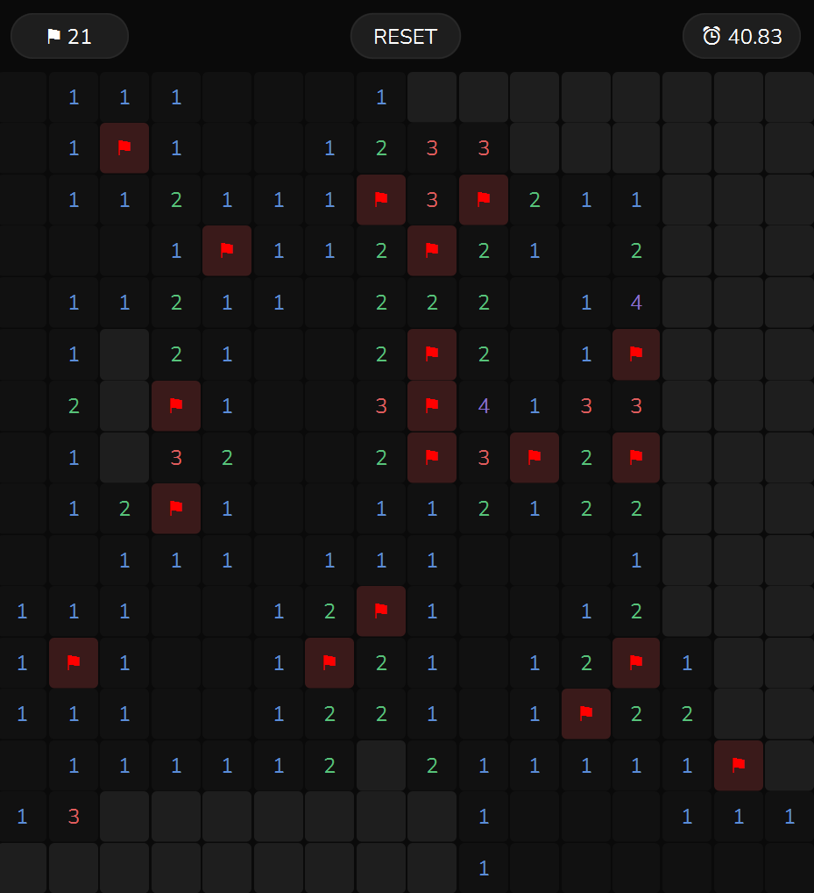

# Mikro omega/ Minesweeper
A minesweeper game built in JavaFX

*its literally just minesweeper..*

## Gameplay
Choose your desired difficulty in the title screen

Click and reveal cells without clicking on a mine!
You can flag cells that you think are mines

You will be shown your total time, difficulty and status at the end

## Difficulties
- Easy: 9x9, 10 mines
- Medium: 16x16, 40 mines
- Hard: 16x30, 99 mines
- Custom: your own! (max 30x50, 1491 mines)

## How to run
Launch main.java from src/java/minesweeper/main.java

## Controls
- Left click to reveal
- Right click to flag

## Dependencies (Maven)
- JavaFX 21
- FXThemes 1.6.0

